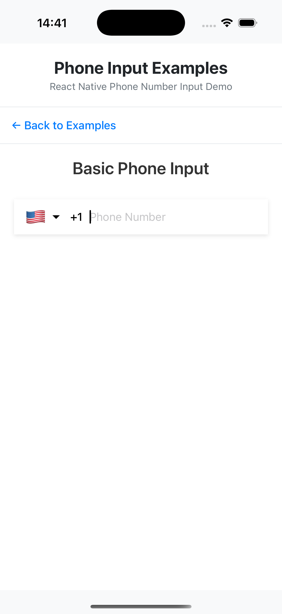
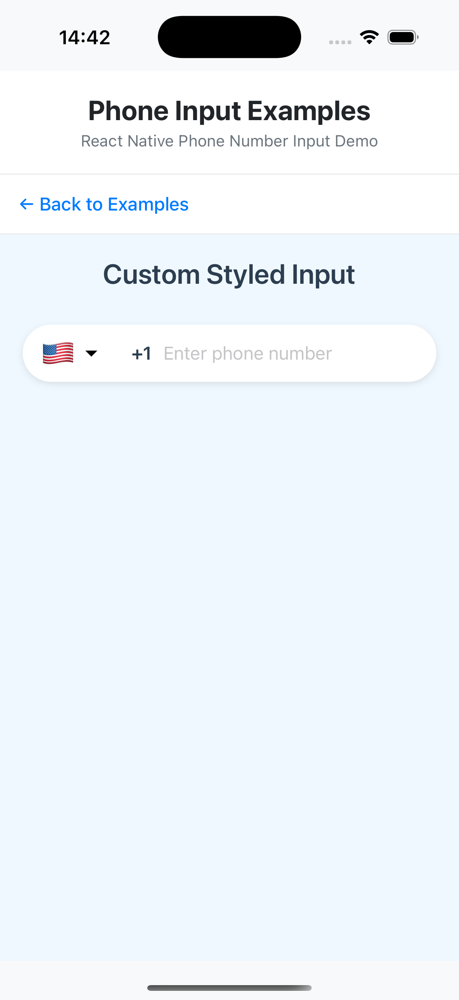
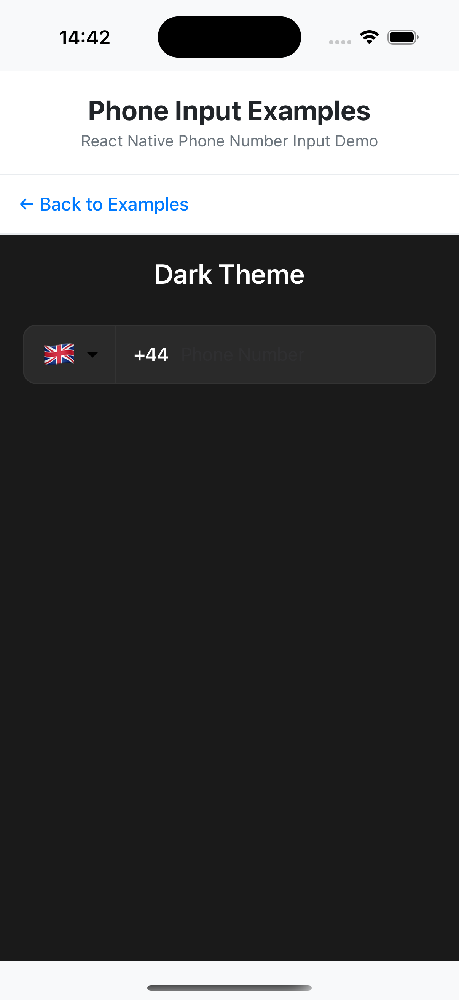
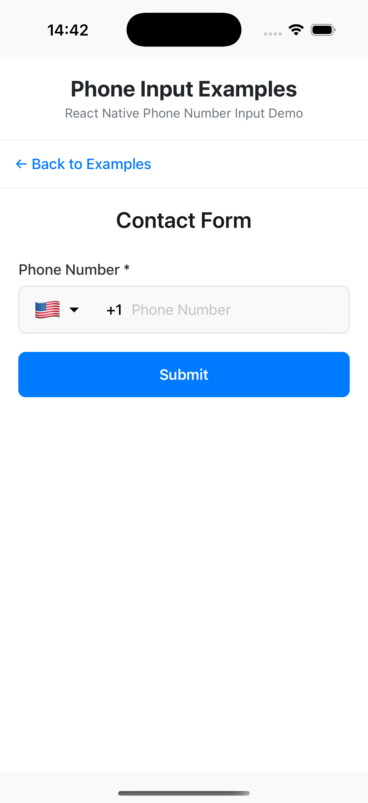

<div align="center">
  <h1>📱 React Native Phone Number Input</h1>
  <p><strong>A powerful, customizable phone input component for React Native</strong></p>

  <div>
    
    
  </div>
  <p>
    <a href="https://www.npmjs.com/package/@linhnguyen96114/react-native-phone-input">
      
    </a>
    <a href="https://github.com/linhnguyen-gt/react-native-phone-number-input/blob/master/LICENSE">
      
    </a>
  </p>
</div>

## ✨ Features

- 📱 Cross-platform support (iOS & Android)
- 🎨 Highly customizable UI
- 🔍 Built-in country search
- ✅ Google LibPhoneNumber validation
- 🎯 TypeScript support
- 🔄 Two flexible layouts
- 🏳️ Country emoji flags support
- 📞 Automatic country detection
- 🎨 Dark theme support
- 🔧 Extensive API

## 🚀 Installation

```bash
# Using npm
npm i @linhnguyen96114/react-native-phone-input

# Using yarn
yarn add @linhnguyen96114/react-native-phone-input

# For iOS
cd ios && pod install
```

## 💡 Examples

### Basic Usage



```tsx
import PhoneInput from '@linhnguyen96114/react-native-phone-input';

const BasicExample = () => {
  const [value, setValue] = useState('');

  return (
    <PhoneInput
      defaultValue={value}
      defaultCode="US"
      onChangeText={setValue}
      withShadow
      autoFocus
    />
  );
};
```

### Custom Styled Input



```tsx
const CustomStyledExample = () => {
  const [value, setValue] = useState('');

  return (
    <PhoneInput
      defaultValue={value}
      defaultCode="US"
      onChangeText={setValue}
      containerStyle={{
        width: '100%',
        borderRadius: 30,
        backgroundColor: '#fff',
        shadowColor: '#000',
        shadowOffset: { width: 0, height: 2 },
        shadowOpacity: 0.1,
        shadowRadius: 3,
        elevation: 3,
      }}
      textContainerStyle={{
        borderRadius: 30,
        backgroundColor: '#fff',
        paddingHorizontal: 15,
      }}
    />
  );
};
```

### Dark Theme



```tsx
const DarkThemeExample = () => {
  const [value, setValue] = useState('');

  return (
    <PhoneInput
      defaultValue={value}
      defaultCode="GB"
      onChangeText={setValue}
      withDarkTheme
      containerStyle={{
        backgroundColor: '#2A2A2A',
        borderRadius: 12,
      }}
      textContainerStyle={{
        backgroundColor: '#2A2A2A',
        borderRadius: 12,
      }}
      textInputStyle={{
        color: '#fff',
      }}
    />
  );
};
```

### Form Integration with Validation



```tsx
const FormExample = () => {
  const [value, setValue] = useState('');
  const [valid, setValid] = useState(false);
  const phoneInput = useRef<PhoneInputRefType>(null);

  const checkValidation = () => {
    const isValid = phoneInput.current?.isValidNumber(value);
    setValid(isValid || false);
  };

  return (
    <PhoneInput
      ref={phoneInput}
      defaultValue={value}
      defaultCode="FR"
      onChangeText={setValue}
      onChangeFormattedText={(text) => {
        console.log('Formatted:', text);
      }}
      containerStyle={{
        width: '100%',
        borderRadius: 8,
        borderWidth: 1,
        borderColor: valid ? '#4CAF50' : '#dee2e6',
      }}
    />
  );
};
```

## 🛠️ Props

| Prop                       | Type                         | Description                          |
|----------------------------|------------------------------|--------------------------------------|
| `withDarkTheme`            | `boolean`                    | Enable dark theme                    |
| `withShadow`               | `boolean`                    | Add shadow effect                    |
| `autoFocus`                | `boolean`                    | Auto focus input                     |
| `defaultCode`              | `CountryCode`                | Default country code                 |
| `defaultCallingCode`       | `string`                     | Default calling code                  |
| `value`                    | `string`                     | Controlled input value               |
| `defaultValue`             | `string`                     | Default phone number value           |
| `disabled`                 | `boolean`                    | Disable input                        |
| `disableArrowIcon`         | `boolean`                    | Hide the dropdown arrow icon         |
| `placeholder`              | `string`                     | Input placeholder text               |
| `onChangeCountry`          | `(country: Country) => void` | Callback when country changes        |
| `onChangeText`             | `(text: string) => void`     | Callback when input text changes     |
| `onChangeFormattedText`    | `(text: string) => void`     | Callback with formatted phone number |
| `onBlur`                   | `() => void`                 | Callback when input loses focus      |
| `onFocus`                  | `() => void`                 | Callback when input gains focus      |
| `renderDropdownImage`      | `JSX.Element`                | Custom dropdown icon component       |
| `containerStyle`           | `StyleProp<ViewStyle>`       | Container style                      |
| `textContainerStyle`       | `StyleProp<ViewStyle>`       | Text input container style           |
| `textInputProps`           | `TextInputProps`             | Additional TextInput props           |
| `textInputStyle`           | `StyleProp<TextStyle>`       | Text input style                     |
| `codeTextStyle`            | `StyleProp<TextStyle>`       | Country code text style              |
| `flagButtonStyle`          | `StyleProp<ViewStyle>`       | Flag button container style          |
| `countryPickerButtonStyle` | `StyleProp<ViewStyle>`       | Country picker button style          |
| `layout`                   | `"first" \| "second"`        | Layout style                         |
| `filterProps`              | `CountryFilterProps`         | Country filter props                 |
| `countryPickerProps`       | `CountryPickerModalProps`    | Country picker modal props           |
| `flagSize`                 | `number`                     | Size of the country flag             |
| `showCountryCode`          | `boolean`                    | Show the country code                |

## 🔧 Methods

| Method                                  | Return Type                                    | Description                                               |
|-----------------------------------------|------------------------------------------------|-----------------------------------------------------------|
| `getCountryCode`                        | `CountryCode`                                  | Get the currently selected country code                   |
| `getCallingCode`                        | `CallingCode \| undefined`                     | Get the calling code for the selected country             |
| `isValidNumber`                         | `boolean`                                      | Validate if the provided phone number is valid            |
| `getNumberAfterPossiblyEliminatingZero` | `{ number: string; formattedNumber: string; }` | Get the phone number with leading zero removed if present |

## 🤝 Contributing

Contributions are welcome! Please read our [contributing guide](CONTRIBUTING.md) to learn about our development process.

## 📝 License

This project is [MIT](LICENSE) licensed.

---

<p>
  Fork from <a href="https://github.com/garganurag893/react-native-phone-number-input">garganurag893/react-native-phone-number-input</a>
  <br/>
  Maintained with ❤️ by <a href="https://github.com/linhnguyen-gt">Linh Nguyen</a>
</p>
